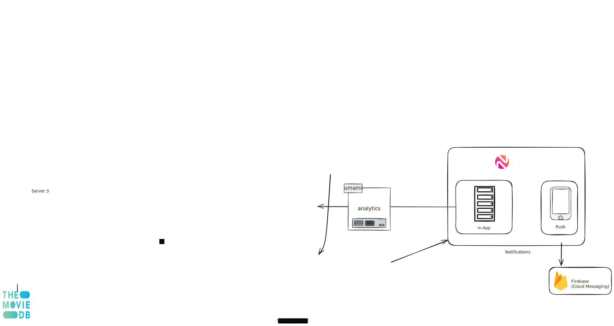
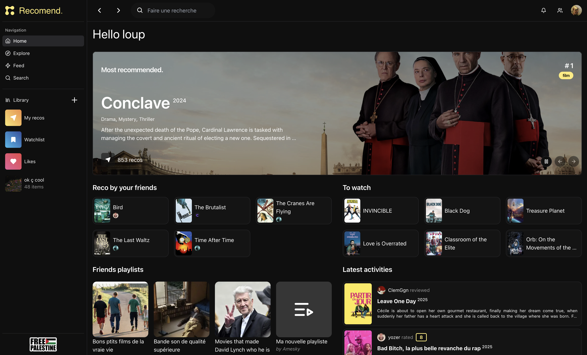

# 🎬 Recomend — Web App

<p align="center">
  
</p>

Web interface of the **Recomend** app, dev by [@lxup](https://github.com/lxup).

## ✅ TODO

- [ ] Adding seasons and episodes (TV Shows)
- [ ] Update english translations

## 🚀 Tech Stack

- ⚡️ [Next.js](https://nextjs.org/) – React Framework
- 🧬 [Supabase](https://supabase.com/) – Auth & Database
- 💳 [RevenueCat](https://www.revenuecat.com/) – Subscriptions
- 🔔 [Novu](https://novu.co/) – In-app Notifications
- 📲 [Firebase Cloud Messaging](https://firebase.google.com/docs/cloud-messaging) – Push Notifications
- ☁️ [Cloudflare R2](https://www.cloudflare.com/products/r2/) – Media Storage
- ⚙️ [Prefect](https://www.prefect.io/) – DB Sync Scripts (with TMDB)
- 🎞️ [TMDB](https://www.themoviedb.org/) – Movie & TV Metadata Provider

<p align="left">
  
</p>

## 📸 Preview



## 📦 Installation

```bash
npm install
cp .env.template .env.local
# Add your environment variables to .env.local
npm run dev
```
